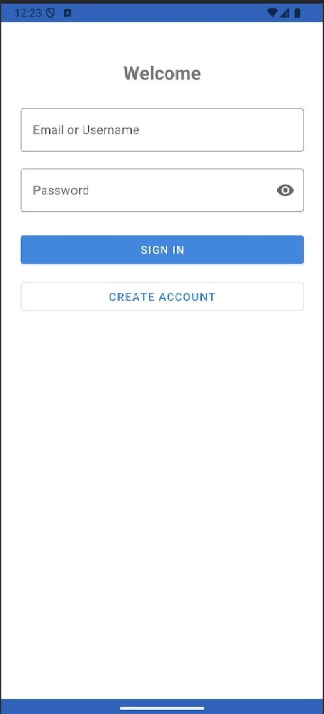
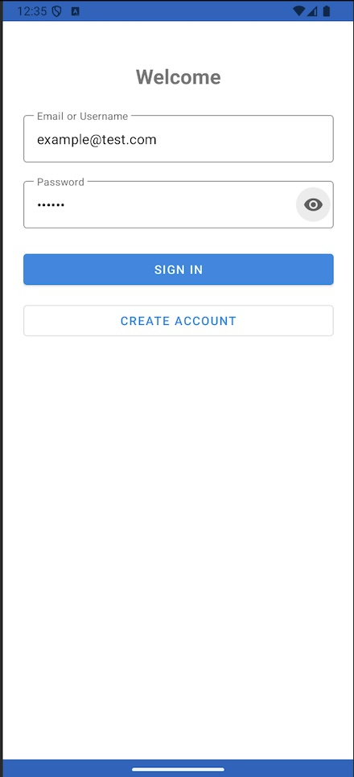

# Weight Tracker App

A simple Android weight tracking application built for CS-360 Mobile Architect & Programming course.

## App Requirements and Goals

This weight tracking app was designed to address the common need for individuals to monitor their weight progress over time. The app serves users who want to set weight goals, track their daily weight entries, and visualize their progress toward achieving their targets. The primary user needs addressed include: easy weight logging, goal setting with BMI awareness, progress visualization, and historical data management.

## User-Centered Design and Features

The app features a user-centered design with four main screens that directly support user needs:

**Home Screen**: Provides an immediate overview with welcome message, current goal progress via circular progress indicator, and quick access to key functions. The design prioritizes the most important information (progress toward goal) prominently while offering convenient shortcuts to common actions.

**Weight Tracking Screen**: Enables easy daily weight logging with smart defaults (latest weight pre-filled), decimal support for precise measurements, and a clean history list. The UI design reduces cognitive load by showing the most recent weight as the starting point, minimizing user input effort.

**Settings Screen**: Manages user preferences including height for BMI calculations and notification preferences. The design groups related settings logically and provides clear feedback for permission requests.

**Goal Setting Screen**: Allows users to set realistic weight targets with BMI validation and target date selection. The bottom sheet design keeps users in context while providing comprehensive goal-setting options.

The UI designs were successful because they prioritized user efficiency (pre-filled latest weight), provided immediate visual feedback (progress indicators, validation messages), and maintained consistency across all screens with Material Design principles and gradient app bars.

## Development Approach and Techniques

The development process employed several key strategies:

**Repository Pattern**: Implemented separate repositories (`WeightsRepository`, `UserRepository`, `WeightGoalRepository`) to abstract database operations, making the code more maintainable and testable. This pattern could be applied to future projects requiring complex data management.

**Real-time Validation**: Used `TextWatcher` for immediate user feedback on weight input, preventing invalid submissions and improving user experience. This technique is valuable for any form-heavy applications.

**Dynamic UI Updates**: Implemented smart defaults and dynamic content (today's date hints, latest weight defaults) that adapt to user data, reducing manual input requirements.

**Generic Algorithm Design**: Created a universal goal progress calculation using `Math.abs()` that works for both weight loss and gain scenarios, demonstrating scalable algorithm design.

## Testing and Quality Assurance

Testing was conducted through iterative development and user interaction simulation:

**Functional Testing**: Verified all core features including weight logging, goal setting, progress calculation, and data persistence. This revealed edge cases like handling empty weight history and invalid input scenarios.

**UI/UX Testing**: Tested the app on API 29 device to ensure compatibility and proper rendering of all UI components. This process revealed API compatibility issues (like `system_error_light` requiring API 34+) that were resolved by using custom colors.

**Data Validation Testing**: Confirmed proper handling of decimal weights, date formatting, and BMI calculations. This testing was crucial for ensuring data integrity and user trust.

The testing process is essential because it reveals real-world usage scenarios that differ from development assumptions, ensuring the app works reliably across different devices and user behaviors.

## Innovation and Problem-Solving

Several challenges required innovative solutions:

**Goal Progress Visualization**: Initially implemented weight-loss-only progress calculation, but innovated by creating a generic algorithm using absolute values that works for any weight goal direction, making the app more versatile.

**Smart Defaults**: Instead of always defaulting to 150.0 lbs, innovated by using the user's latest weight as the default, significantly improving user experience for consecutive entries.

**Permission Handling**: Developed a sophisticated permission request system that prevents duplicate messages and provides clear user feedback, addressing the common Android permission UX challenge.

**Dynamic Content**: Created programmatic gradient application and dynamic date hints that adapt to user context, providing a more personalized experience.

## Technical Excellence Demonstration

The **CircularProgressView** custom component best demonstrates technical knowledge and skills. This component required:

- Custom `onDraw()` implementation with `Canvas` and `Paint` objects
- Mathematical calculations for arc drawing and progress percentage
- Proper color management and text rendering
- Integration with Android's view lifecycle

This component showcases advanced Android development concepts including custom view creation, mathematical graphics programming, and proper resource management, demonstrating mastery of both fundamental and advanced Android development techniques.

## References

- [Material Design Icons](https://fonts.google.com/icons) - UI icons
- [Android Developer Documentation](https://developer.android.com/) - Core Android development
- [Material Design Guidelines](https://material.io/design) - UI/UX design principles
- [SQLite Documentation](https://www.sqlite.org/docs.html) - Database implementation
- [Android Permissions Guide](https://developer.android.com/guide/topics/permissions/overview) - Runtime permissions

## Screenshots

### Login & Registration

_Secure user authentication with account creation and login_

### Home Dashboard

_Main dashboard with quick actions, goal progress, and streak tracking_

_Home screen with navigation menu open_

### Weight Tracking

_Weight logging interface with date picker and decimal input support_

### Goal Management

_Goal setting with BMI calculation and progress visualization_

### Weight History

_Historical weight data with trend analysis and streak information_

### Settings

_User preferences including height, notifications, and account management_

### Notification History

_Notification tracking and history display_

## Technical Requirements

- Android API 29+ (Android 10+)
- SMS and notification permissions (optional)
